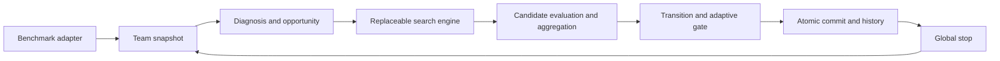

# Multi-agent Prompt Search

Jointly optimize a prompt team with frozen model weights and benchmark-defined
evaluation. The sole active research architecture is Unified Team Prompt Search.
The scientific specification is [CURRENT_SPEC](docs/design/CURRENT_SPEC.md).



## Start here

Read [AGENTS](AGENTS.md), [repository map](docs/REPOSITORY_MAP.md),
[method overview](method.md) and [current architecture](docs/CURRENT_ARCHITECTURE.md).
Current experiment state is in [current frontier](experiments/current_frontier.yaml)
and [research state](docs/research/CURRENT_RESEARCH_STATE.md).

## Offline quick start

```powershell
python scripts/audit_repository_governance.py --check-generated
python tests/formal_zero_api_runner.py tests --suite=current
python scripts/run_experiment.py --help
```

The sole current execution entrypoint is scripts/run_experiment.py. Real execution
requires a governed frozen prep and explicit attempt-specific authorization.
Test commands use fake providers and a pre-import network guard.

New experiments compose only through the complete current policy bundle and
`build_current_team_prompt_search`. See
[current runtime composition](docs/design/CURRENT_RUNTIME_COMPOSITION.md).
Older implementations use explicit `legacy` replay tooling.

## Governance and evidence

[Registry](experiments/registry.yaml) records metadata; [lineage authority](experiments/lineage.yaml)
generates [LINEAGE](docs/experiments/LINEAGE.md). New experiments use the
[current template](experiments/templates/unified_experiment_v2_3.yaml).
[Reports index](reports/INDEX.md) catalogs immutable evidence. Reports are
evidence, never design authority. [Archives](docs/archive/) preserve historical
contracts and paper text with source provenance.

## Current V2.3 method state

V2.3 is the sole active scientific method; V2.2 and paired execution are permanently retired.
The production entrypoint is `scripts/run_experiment.py`, using `MATHEvidenceBinding`,
the complete current policy bundle and `build_current_team_prompt_search`.
Missing or historical method, evidence and trajectory identities fail closed.

Five qwen3-8b members use V6 ordinary visible mathematical steps and one final
answer line, with thinking disabled. qwen3.7-flash supplies independent
trajectory/reference Gradients, gradients-only clustering and conservative
Layer1 edits. Equal-weight equivalence plurality and fixed peers remain.
Mutation, SearchValidation and TeamProbe are disjoint Optimize memberships.
Layer1 keeps six generations, 42 metric calls and four exports; at most two
candidates reach Full. The immutable initial competence floor, nonregressing
Full Vote, strict target OR team progress and winner-only Shadow gate remain.
Measured initial competence and edit effects enter bounded Memory; uncommitted
candidate coverage cannot replace committed competence. Team-epoch no-commit
patience remains two. Operational horizon/budget stops do not prove saturation.

Real-model adherence and efficacy remain unverified. Fresh source, manifest,
request, attempt, cache and ledger identities precede exact single-use API
approval. Historical authorizations grant no new access. Validation is not
authorized and Test remains sealed. Current execution uses MATH; IFBench and
HotpotQA contracts remain maintained, with their execution blockers intact.
