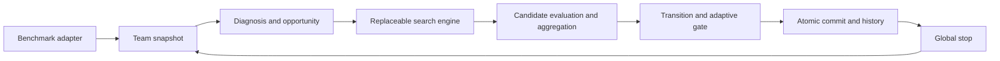

# Multi-agent Prompt Search

Jointly optimize a prompt team with frozen model weights and benchmark-defined
evaluation. The sole active research architecture is Unified Team Prompt Search.
The scientific specification is [CURRENT_SPEC](docs/design/CURRENT_SPEC.md).



## Start here

Read [AGENTS](AGENTS.md), [repository map](docs/REPOSITORY_MAP.md),
[method overview](method.md) and [current architecture](docs/CURRENT_ARCHITECTURE.md).
Current experiment state is in [current frontier](experiments/current_frontier.yaml)
and [research state](docs/research/CURRENT_RESEARCH_STATE.md).

## Offline quick start

```powershell
python scripts/audit_repository_governance.py --check-generated
python tests/formal_zero_api_runner.py tests --suite=current
python scripts/run_experiment.py --help
```

The sole current execution entrypoint is scripts/run_experiment.py. Real execution
requires a governed frozen prep and explicit attempt-specific authorization.
Test commands use fake providers and a pre-import network guard.

## Governance and evidence

[Registry](experiments/registry.yaml) records metadata; [lineage authority](experiments/lineage.yaml)
generates [LINEAGE](docs/experiments/LINEAGE.md). New experiments use the
[current template](experiments/templates/unified_experiment_v2_1.yaml).
[Reports index](reports/INDEX.md) catalogs immutable evidence. Reports are
evidence, never design authority. [Archives](docs/archive/) preserve historical
contracts and paper text with source provenance.

## Current V2.1 method state

The active opt-in method is `unified_team_prompt_search_v2_1`.
Use `SearchMethodConfig.v2_1()` and the shared binary production composition.
Pattern selects one mechanism after WHO, with explicit all-residual coverage
metrics. The current opt-in [Pattern path](docs/design/PATTERN_GRADIENT_DISCOVERY_V4.md)
extracts one textual gradient per wrong example, clusters gradients only and selects
one generalized correction with the unchanged responsibility F. Deployment requires strict team gain above an immutable initial member
competence floor. Memory stores grounded strategy experience, default disabled.
V1/V2 factories and frozen bindings remain replay identities; current experiments
need a fresh V2.1 binding, preexecution freeze and explicit authorization.
See CURRENT_SPEC for precise rules; fake conformance does not establish efficacy.
The active research suite is MATH, IFBench and HotpotQA. BBH is historical
development/replay only. Canonical data and separate experiment memberships
are frozen; IFBench responsibility and HotpotQA retrieval remain HOLD.
The current experiment binding uses Solver qwen3-8b everywhere, with
optimizer/reflection and Pattern qwen3.7-flash. No real execution is authorized.
