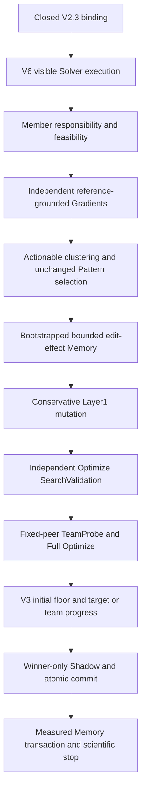

# Current Runtime Composition

The sole active research architecture is Unified Team Prompt Search.
V2.3 is the unique current method. `CURRENT_RUNTIME_COMPOSITION_V1` retains
the existing builder boundary; scientific search, scoring and transition semantics
are unchanged by closure cleanup.

`scripts/run_experiment.py` resolves only `MATHEvidenceBinding`; this binding
does not inherit a historical executor. Parent JSON supplies pinned data/settings
provenance, never a factory. `CurrentPolicyBundle` requires non-null V2.3 and V6
policies. Constructors, schemas, broker, local search, evidence and Memory have
no executable historical fallback. The mutation request carries only its focused
examples, selected hypothesis and bounded Memory.

Actual serialized requests and complete deterministic synthetic outcomes are
compared against source `7342d85a877880717b00cd19ddc4ab6e598e81e4`.
The historical V6 projection receipt retains legacy-named schema fields as inert
provenance; current diagnostic/mutation schemas come exclusively from V2.3.
These fields cannot select a Gradient or Layer1 path.

Historical bodies are archived with exact Git-blob SHA-256 values and an invariant
index under `docs/archive/runtime/a4_pre_v23_only_7342d85`. Replay requires the
original source checkout. No reports, manifests, ledgers or raw traces are deleted.
Cancelled comparison scopes remain immutable evidence and cannot authorize work.

Current data dependencies preserve canonical/split/subset hashes, evaluator and
SDK pins, generic-team hashes and length-only accounting metadata. No held-out
content is projected into optimization. Execution remains HOLD until a fresh
single-arm freeze and exact single-use approval pass all preflights.
