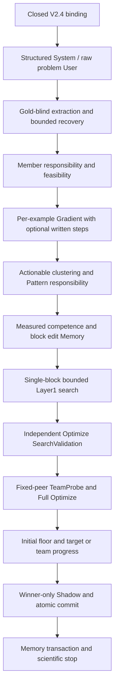

# Current Runtime Composition

The sole active research architecture is Unified Team Prompt Search.
V2.4 is the only current executable method, composed through
`build_current_team_prompt_search` and `CURRENT_STRUCTURED_SYSTEM_COMPOSITION_V2`.

`scripts/run_experiment.py` resolves only `MATHStructuredBinding`. Every Solver
stage uses the same two-message wire contract. Historical parent JSON supplies
pinned dataset/settings provenance; it cannot select an executor or supply
responses, competence or authorization. Full current policies and fresh exact
single-use scopes are mandatory. Development and preparation remain zero API.

The active scientific authority is [CURRENT_SPEC.md](CURRENT_SPEC.md), with
[the structured prompt contract](STRUCTURED_SYSTEM_PROMPT_V24.md). Retired method
implementations are recoverable from the Git sources in the cleanup tombstone.
