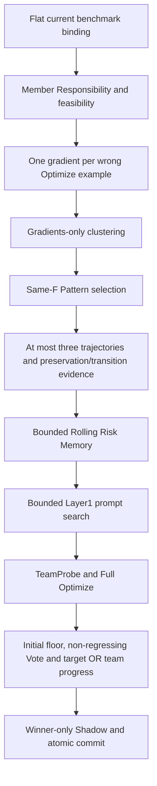

# Current Runtime Composition

The sole active research architecture is Unified Team Prompt Search.
The opt-in current evidence-learning revision is V2.3 with the preserved
target-or-team deployment V3. The same builder selects its complete versioned
policy through `optimization_evidence_policy`; no new controller is introduced.
Its [normative contract](OPTIMIZATION_EVIDENCE_V23.md) binds independent Optimize
roles, conservative hypothesis edits and bootstrapped edit-effect Memory.
Historical V2.2 and its visible-solution correction remain explicit compatibility
and controlled comparison paths. V2.3 requires its own fresh binding and scope.
CURRENT_RUNTIME_COMPOSITION_V1 remains the builder boundary; the method and
transition identities change explicitly. Current real execution requires a fresh
MATH_V2_2_EXECUTION_BINDING_V1 and the fixed operational horizon/resource ceiling
defined in V22_OPERATIONAL_PILOT_CEILING_V1.md. Unbound profiles remain HOLD.
The new default offline profile is an explicit HOLD declaration. V2.1
Gradient profiles, strict transition, composition and N-commit bound are
available only under explicit historical replay and the original frozen source.

New experiments use `scripts/run_experiment.py`,
`benchmarks.math_domain_binding.execution_binding`, the flat
`MATHGradientPatternBinding`, and
`search.current_composition.build_current_team_prompt_search`.
The current fake-provider builder accepts one complete `CurrentPolicyBundle`.
The unfrozen real binding cannot compose providers.
The separately versioned partition-completion capability is explicitly activated
by a fresh binding. It validates generalized gradients against controller-only
provenance, appends only known omissions to unassigned, and stores a separate
normalization journal before the unchanged decode and same-F scorer. Provenance
never enters the gradients-only provider request. Historical absent-policy
bindings preserve their original method identity and strict membership behavior.

`CurrentOptimizer` and `CurrentEngine` use generic bounded search/task primitives.
Neither inherits a Raw-Pattern treatment class. Rolling Memory extends extracted
private-action and transactional-state primitives without importing an older
Memory implementation. Context assembly creates one dictionary and serializes
once. The existing instruction, record ordering and canonical serialization
remain byte identical for the frozen synthetic oracle.

Historical parent bindings are JSON provenance receipts. Their file hashes and
transitive receipt dependencies are validated as data; they supply no inherited
`method()` or `compose()` implementation. Unchanged component compatibility
retains the existing generation policies, memberships, candidate rules and n+1
Pattern accounting. Missing Gradient or Memory dependencies fail before provider
dispatch. Current configuration never falls back to raw Pattern or null treatment.

`current_math_dependencies` preserves the canonical source hashes, source pins,
split cardinality and disjointness, Low-Cost metadata membership, evaluator and SDK
pins, initial-team contract, accounting metadata and ledger containment checks.
These checks use metadata and byte hashes; held-out records are never projected
into search. They do not instantiate a historical binding or load a GEPA engine.

Older implementations live in `search/legacy/`, `benchmarks/legacy/` and
`governance/legacy/`. Compatibility imports preserve existing public replay paths;
current dependency closure must contain neither these namespaces nor historical
treatment definitions. Historical execution tooling uses `scripts/replay_experiment.py`
and explicit legacy binding/governance imports. It retains separate frozen source,
integrity and authorization requirements; parsing an old manifest cannot dispatch
it through the current CLI.

The initial-condition amendment archives exact V1_1 team bytes with a provenance
and invariant index. Only the new amendment's explicit path/hash pair resolves
historical initial-team receipt references to that archive. All other receipt
dependencies retain exact path and hash verification. The effective current
team is independently checked against V1_2 and its new artifact/team hashes.
Old closed bindings remain unchanged and require their frozen historical source
for replay. New scopes include initial-team identity and never reuse old Pilot
authorization; fresh runs start with empty Memory and independent member lanes.
Historical MATH compatibility tests use an explicit isolated V1_1 artifact
workspace; this test fixture changes no legacy runtime or historical evidence.

The historical numeric-admissibility amendment derives Guard V5 / Gradient prompt
V3 from a hash-pinned V1_2 parent as data-only provenance. It changes only those
two treatment fields and fresh attempt/cache/scope metadata. The parent policy,
budgets, initialization, memberships and all remaining method fields must match
the exact derivation. The runtime verifies every parent receipt and archives the
old initial-team reference explicitly; it never composes an old policy. Historical V2.1
offline conformance uses Guard V6 profile V5 and Pilot offline profile V4.
The V6 calibration preserves Prompt V3 and changes only the bounded evidence
threshold: bare coincidence warns; strong source-bound numeric evidence rejects. These profiles
grant no dispatch; fresh Pilot execution needs its own frozen single-use scope.

Current tests are selected by `tests/suite_classification.json`; new entrypoint
and dependency tests live in `tests/current/`. Public compatibility tests remain
explicit replay checks and are reported with their existing suite classifications.
Private artifacts and full historical replay are reported separately. The final
full current suite must run on the final runtime source commit.

No Canary, Pilot, Validation, Test, real provider call or efficacy result follows
from this consolidation. Existing offline profiles remain code conformance only.

Current Guard V6 uses [strong/weak evidence calibration](NUMERIC_PROVENANCE_GUARD_V6.md).
Prompt V3, hard400 and unchanged component semantics remain frozen. Historical V2.1 recovery
profile V6 and Pilot offline profile V5 opt into
[Gradient recovery V1](GRADIENT_CONTRACT_RECOVERY_V1.md); historical profiles
retain one physical draw. The new policy enters method/provider identity and
composition, and only its physical Gradient ceilings increase. First-valid
selection never evaluates semantic usefulness or sends rejected outputs back.
