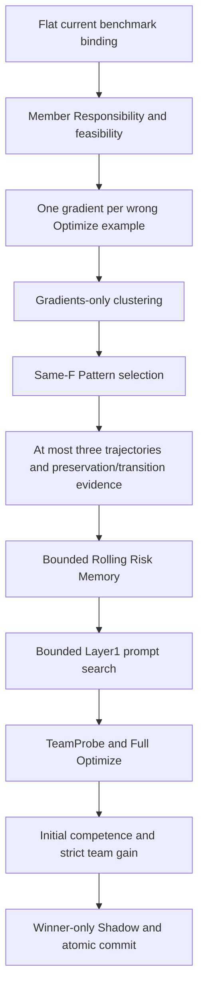

# Current Runtime Composition

The sole active research architecture is Unified Team Prompt Search.
This is an engineering consolidation of the existing scientific treatment.
`CURRENT_RUNTIME_COMPOSITION_V1` names the composition boundary; all scientific
identity values and provider-visible prompt bytes remain unchanged.

New experiments use `scripts/run_experiment.py`,
`benchmarks.math_domain_binding.execution_binding`, the flat
`MATHGradientPatternBinding`, and
`search.current_composition.build_current_team_prompt_search`.
The current binding accepts one complete `CurrentPolicyBundle`.

`CurrentOptimizer` and `CurrentEngine` use generic bounded search/task primitives.
Neither inherits a Raw-Pattern treatment class. Rolling Memory extends extracted
private-action and transactional-state primitives without importing an older
Memory implementation. Context assembly creates one dictionary and serializes
once. The existing instruction, record ordering and canonical serialization
remain byte identical for the frozen synthetic oracle.

Historical parent bindings are JSON provenance receipts. Their file hashes and
transitive receipt dependencies are validated as data; they supply no inherited
`method()` or `compose()` implementation. The complete effective current contract
retains the existing generation policies, memberships, candidate rules and n+1
Pattern accounting. Missing Gradient or Memory dependencies fail before provider
dispatch. Current configuration never falls back to raw Pattern or null treatment.

`current_math_dependencies` preserves the canonical source hashes, source pins,
split cardinality and disjointness, Low-Cost metadata membership, evaluator and SDK
pins, initial-team contract, accounting metadata and ledger containment checks.
These checks use metadata and byte hashes; held-out records are never projected
into search. They do not instantiate a historical binding or load a GEPA engine.

Older implementations live in `search/legacy/`, `benchmarks/legacy/` and
`governance/legacy/`. Compatibility imports preserve existing public replay paths;
current dependency closure must contain neither these namespaces nor historical
treatment definitions. Historical execution tooling uses `scripts/replay_experiment.py`
and explicit legacy binding/governance imports. It retains separate frozen source,
integrity and authorization requirements; parsing an old manifest cannot dispatch
it through the current CLI.

Current tests are selected by `tests/suite_classification.json`; new entrypoint
and dependency tests live in `tests/current/`. Public compatibility tests remain
explicit replay checks and are reported with their existing suite classifications.
Private artifacts and full historical replay are reported separately. The final
full current suite must run on the final runtime source commit.

No Canary, Pilot, Validation, Test, real provider call or efficacy result follows
from this consolidation. Existing offline profiles remain code conformance only.
