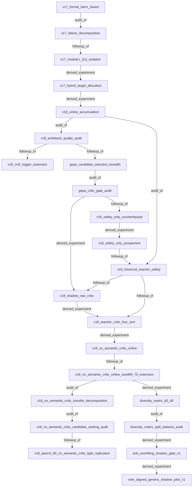

# Experiment Lineage

Generated from `experiments/lineage.yaml`; edit the YAML authority, not this file.

## Topological order

1. `v17_formal_5arm_3seed`
2. `v17_failure_decomposition`
3. `v17_module1_2x2_isolation`
4. `v17_hybrid_target_allocation`
5. `v18_online_accumulation`
6. `v18_writeback_quality_audit`
7. `gepa_candidate_selection_breadth`
8. `v18_m2f_trigger_extension`
9. `gepa_critic_gate_audit`
10. `v18_safety_only_counterfactual`
11. `v18_safety_only_prospective`
12. `v18_historical_teacher_safety`
13. `v18_shadow_raw_critic`
14. `v18_teacher_critic_four_arm`
15. `v18_no_semantic_critic_online`
16. `v18_no_semantic_critic_online_seed69_70_extension`
17. `diversity_matrix_d0_d5`
18. `v18_no_semantic_critic_transfer_decomposition`
19. `diversity_matrix_split_balance_audit`
20. `v18_no_semantic_critic_candidate_ranking_audit`
21. `anti_overfitting_shadow_gate_v1`
22. `v18_qwen3_8b_no_semantic_critic_light_replication`
23. `vote_aligned_generic_shadow_pilot_v1`
