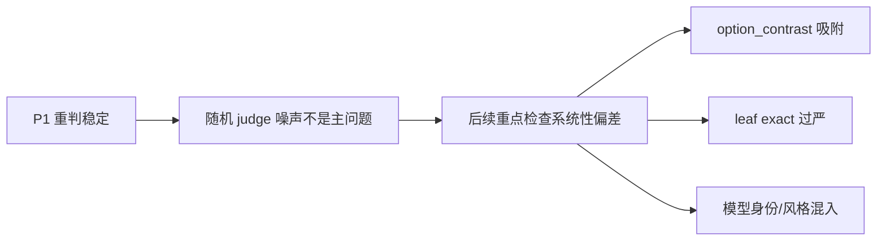
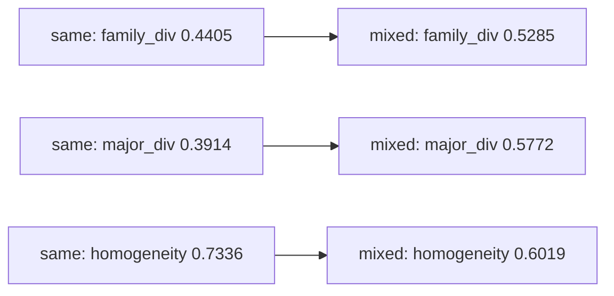

# 证明实验结果总分析（按实验矩阵）

本文按 `prove_experiments/experiment_matrix.md` 的顺序汇总当前证明实验结果。P5 当前未纳入，因为本轮明确先不跑 reward sweep。本文默认采用已完成质量控制后的可用 trace 作为解释口径；当某些模型仍有较多无效 trace 时，只作为风险说明，不再把历史目录作为对照口径展开。

## 0. 指标中文含义

| 指标 | 中文含义 | 解读方向 |
|---|---|---|
| `family_div` / `mean_family_diversity` | 策略树加权多样性。综合 primary/secondary leaf 与同主类相似度后计算 5 个 agent 的策略分散程度。 | 越高表示团队策略越分散。 |
| `homogeneity` / `mean_family_homogeneity_rate` | 策略同质性。衡量 5 个 agent 是否集中在相同或相近策略。 | 越低越好，表示不容易塌缩到同一策略。 |
| `major_div` / `mean_major_family_diversity` | 主类策略多样性。只看 major family 层面的分散程度。 | 越高表示跨大类策略更多。 |
| `target_exact_hit_rate` | 目标 leaf 精确命中率。自动 judge 的 primary/secondary 是否命中 prompt 指定 leaf。 | 严格，但容易受 leaf 粒度和 `option_contrast` 吸附影响。 |
| `target_same_major_hit_rate` | 目标主类命中率。自动 judge 的 primary/secondary 是否落在目标 leaf 所属 major。 | 比 exact 更稳健。 |
| `vote_acc` | 5 个 agent 多数投票答案准确率。 | 用于确认多样性提升是否牺牲答题效果。 |
| `trace_embedding_cosine_diversity` | 完整 trace embedding 的平均余弦差异。 | 更容易受模型风格、长度和表达方式影响。 |
| `summary_embedding_cosine_diversity` | reasoning summary embedding 的平均余弦差异。 | 比完整 trace 更压缩，但仍偏文本语义。 |
| `major_distribution_distance` | 同一道题两个 team 的 major-family 分布距离。 | 用于 P4 分解 prompt 效应和模型身份效应。 |

## 1. 总结论

当前结果支持一个谨慎但正向的结论：策略树分类指标确实能测到显式策略 prompt 引起的结构化策略差异，尤其在主类层面更清楚；但它不是纯粹的“真实策略真值”，仍会受到模型身份、输出风格、MMLU 多选题形态和 taxonomy primary 判定规则影响。

最关键的证据链如下：

| 问题 | 当前证据 | 结论 |
|---|---|---|
| judge 是否随机不稳定 | P1 同 trace 重判：major 一致率 0.9700，primary 一致率 0.9533，pair 一致率 0.8617。 | 随机 judge 噪声不是主问题。 |
| 显式不同策略是否提高策略树多样性 | P3 四模型、五主类策略：有效 trace 口径下 mixed - same 的 `family_div` +0.0900、`major_div` +0.1755、`homogeneity` -0.1213，Wilcoxon p 均小于 1e-11。 | 策略 prompt 能系统改变 team-level 策略分布。 |
| 指标是否只是在测模型身份/风格 | P4 同模型不同 prompt 距离 0.1939；不同模型同 prompt 距离 0.2920。 | prompt 有效，但模型身份效应更强，不能把跨模型差异都解释成策略差异。 |
| leaf exact 是否过严 | P3 mixed exact 低，GPT-5.5 normal judge 只在 27.5% 抽样中支持原 `option_contrast` 主判定，72.5% 质疑原判。 | leaf exact 不能作为唯一有效性证据，major/weighted-tree 更可靠。 |
| GPT-5.5 盲评是否支持策略树 | P7 中策略树分数与 GPT-5.5 方法多样性 Spearman 约 0.0075，文本 trace 多样性约 0.6829。 | GPT-5.5 盲评更受表面展开方式影响；策略树指标与“人感知方法差异”不是同一个量。 |
| taxonomy 粒度是否合理 | P6 平均 major-only 0.4060、weighted-tree 0.4735、strict-leaf 0.5875。 | weighted-tree 是折中口径；strict leaf 更敏感但更可能噪声化。 |

## P1. Judge 可靠性

P1 检查同一条 trace 重复交给 judge 时，标签是否稳定。

| trace_count | judgment_count | mean_major_agreement | mean_primary_agreement | mean_pair_agreement | mean_confidence |
|---:|---:|---:|---:|---:|---:|
| 200 | 600 | 0.9700 | 0.9533 | 0.8617 | 0.8433 |

预设通过标准是 major 一致率不低于 0.85，primary 一致率不低于 0.70。当前结果明显通过。因此后续异常更应优先解释为系统性 taxonomy 偏差、prompt 可执行性差异、模型身份差异或 trace 质量问题，而不是随机重判噪声。

## P2. 同策略负对照

P2 的目的不是证明多样性提升，而是确认“同一宽策略的不同措辞”不会被指标误判成强策略多样性。same-elimination 条件中，5 个 agent 都围绕选项排除策略，只是措辞不同。

P4 中的 same-elimination 四模型结果可作为 P2 的跨模型负对照：

| model | family_div | major_div | homogeneity | target exact | target same-major | vote_acc |
|---|---:|---:|---:|---:|---:|---:|
| deepseek-chat | 0.4786 | 0.4889 | 0.6915 | 0.5680 | 0.5920 | 0.9000 |
| gemini-2.5-flash-lite | 0.4034 | 0.3051 | 0.8256 | 0.7660 | 0.7720 | 0.8000 |
| gpt-4o-mini | 0.4210 | 0.3486 | 0.7618 | 0.7760 | 0.8040 | 0.8400 |
| qwen2.5-7b-instruct | 0.4565 | 0.2851 | 0.7277 | 0.7200 | 0.8180 | 0.7700 |

P2 的读法是：same-elimination 的 `target exact` 和 `target same-major` 明显高于 P3 mixed 条件，说明同策略 prompt 在标签层面确实更集中；但 `family_div` 并不接近 0，说明即使同为选项排除，MMLU trace 也会自然混入概念匹配、规则应用、分解、反向检查等子策略。这个现象不是指标失败，而是提醒我们：同策略负对照应该主要看相对差异和主类同质性，而不是期待所有 trace 完全同 leaf。

qwen 在 same 条件下的有效题数较低，因此它不适合作为最强负对照模型。gpt-4o-mini、gemini 和 deepseek 的 same 条件更适合作为 P2 主证据。

## P3. 显式策略干预

P3 当前正式设计使用 4 个 solver model，每个模型跑 100 道 MMLU，same 条件是同一宽策略的选项排除，mixed 条件是 5 个 agent 分别使用来自 5 个不同主类的策略。必须先确认这 5 个策略确实属于不同主类：

| agent | target leaf | target major | 中文解释 |
|---|---|---|---|
| 0 | `distractor_elimination` | `mmlu_option_semantics` | 逐项排除干扰项，保留最符合题干的选项。 |
| 1 | `rule_or_principle_application` | `mmlu_domain_reasoning` | 先识别领域规则、定理、原则或机制，再应用到题干。 |
| 2 | `decomposition` | `representation_formalization` | 把题干拆成事实、约束和子问题，再合并得到答案。 |
| 3 | `case_analysis` | `logical_proof` | 枚举相关条件、情形或分支并逐一检验。 |
| 4 | `edge_case_analysis` | `optimization_boundary_meta` | 检查边界条件、限定词、例外或极端情形。 |

### P3 主结果

有效 trace 口径下，mixed 条件在四模型总体上比 same 条件有稳定提升：

| condition | valid questions | family_div | major_div | homogeneity | vote_acc |
|---|---:|---:|---:|---:|---:|
| same | 331 / 400 | 0.4405 | 0.3914 | 0.7336 | 0.8144 |
| mixed | 380 / 400 | 0.5285 | 0.5772 | 0.6019 | 0.8359 |
| mixed - same | 329 paired | +0.0900 | +0.1755 | -0.1213 |  |

paired 检验结果：

| metric | paired n | mixed - same | 95% CI | Wilcoxon p |
|---|---:|---:|---:|---:|
| `team_family_diversity` | 329 | +0.0900 | [0.0665, 0.1146] | 6.45e-12 |
| `team_family_homogeneity_rate` | 329 | -0.1213 | [-0.1527, -0.0896] | 1.24e-13 |
| `team_major_family_diversity` | 329 | +0.1755 | [0.1325, 0.2200] | 2.91e-13 |

按模型拆开看：

| model | condition | valid questions | family_div | major_div | homogeneity | vote_acc |
|---|---|---:|---:|---:|---:|---:|
| deepseek-chat | same | 100/100 | 0.4563 | 0.5023 | 0.6625 | 0.9300 |
| deepseek-chat | mixed | 100/100 | 0.5564 | 0.7584 | 0.4745 | 0.9100 |
| gemini-2.5-flash-lite | same | 100/100 | 0.4124 | 0.3162 | 0.8058 | 0.7900 |
| gemini-2.5-flash-lite | mixed | 99/100 | 0.4546 | 0.3902 | 0.7575 | 0.8081 |
| gpt-4o-mini | same | 100/100 | 0.3395 | 0.2156 | 0.8566 | 0.8600 |
| gpt-4o-mini | mixed | 100/100 | 0.4807 | 0.4243 | 0.7157 | 0.8600 |
| qwen2.5-7b-instruct | same | 31/100 | 0.5538 | 0.5313 | 0.6095 | 0.6774 |
| qwen2.5-7b-instruct | mixed | 81/100 | 0.6224 | 0.7362 | 0.4601 | 0.7654 |

qwen 的 same 条件有效题数只有 31/100，因此 qwen 的 P3 same 结果要谨慎读。即便如此，四模型合并的 paired 结果仍显示 mixed 显著提高 family/major 多样性并降低同质性。

### P3 目标策略命中

P3 的关键不是每个 agent 都稳定命中指定 leaf，而是 team-level 策略分布是否随 prompt 改变。目标命中拆解如下：

| condition | agent | target leaf | target major | exact | same-major(any) | top primary | top primary share |
|---|---:|---|---|---:|---:|---|---:|
| mixed | 0 | `distractor_elimination` | `mmlu_option_semantics` | 0.2275 | 0.6900 | `option_contrast` | 0.4550 |
| mixed | 1 | `rule_or_principle_application` | `mmlu_domain_reasoning` | 0.1675 | 0.3400 | `option_contrast` | 0.2825 |
| mixed | 2 | `decomposition` | `representation_formalization` | 0.3725 | 0.3875 | `decomposition` | 0.3700 |
| mixed | 3 | `case_analysis` | `logical_proof` | 0.1175 | 0.1375 | `option_contrast` | 0.4450 |
| mixed | 4 | `edge_case_analysis` | `optimization_boundary_meta` | 0.0525 | 0.0525 | `option_contrast` | 0.4625 |

`distractor_elimination` 的 same-major 命中最高，`decomposition` 的 exact 命中最高；`edge_case_analysis` 最弱。`option_contrast` 仍是很多 mixed trace 的 top primary，说明 MMLU 多选题的可见推理形态容易被 judge 判成选项比较。这是 P3 暴露出的主要风险：策略树分数提升是真实的，但 leaf exact compliance 不能直接解释为“每个 agent 都按指定 leaf 严格执行”。

### P3 GPT-5.5 复核

GPT-5.5 normal taxonomy judge 是更强证据，因为它拿到与正常 judge 接近的信息并重新打 taxonomy 标签。Prompt-following 只作为补充诊断。

| 复核 | n | 核心指标 | 结果 |
|---|---:|---|---:|
| GPT-5.5 normal taxonomy judge | 40 | GPT primary option | 0.2750 |
| GPT-5.5 normal taxonomy judge | 40 | GPT target exact | 0.2250 |
| GPT-5.5 normal taxonomy judge | 40 | GPT target same-major | 0.3000 |
| GPT-5.5 normal taxonomy judge | 40 | judge/taxonomy questioned | 0.7250 |
| GPT-5.5 prompt-following | 40 | followed rate | 0.6000 |
| GPT-5.5 prompt-following | 40 | partial-or-better | 0.8000 |
| GPT-5.5 prompt-following | 40 | model/prompt likely | 0.2250 |

按目标策略看 prompt-following：

| target | followed | mean_score | 诊断 |
|---|---:|---:|---|
| `distractor_elimination` | 0.8750 | 4.6250 | 容易遵循，自动 judge 容易吸到 `option_contrast`。 |
| `rule_or_principle_application` | 0.2500 | 3.0000 | 遵循不稳定，prompt/模型执行能力可能不足。 |
| `decomposition` | 0.8750 | 4.3750 | 容易遵循，但自动 leaf exact 未充分反映。 |
| `case_analysis` | 0.8750 | 4.1250 | GPT-5.5 认为可遵循，自动 judge 容易被表面选项比较吸走。 |
| `edge_case_analysis` | 0.1250 | 2.5000 | 最难遵循，策略本身或 prompt 需要重写。 |

P3 综合结论：策略树指标确实测到了显式策略 prompt 导致的结构化变化；但 exact leaf hit 过严，并且部分策略 prompt 可执行性不足。主报告应以 `family_div`、`major_div`、`homogeneity` 和 GPT-5.5 normal taxonomy judge 为主证据。

## P4. 跨 LLM 策略迁移

P4 的目标是回答：策略树指标测到的是策略 prompt 效应，还是模型身份/风格效应？因此分成四组对比：

| 对比组 | 含义 | 本实验中的实现 |
|---|---|---|
| 相同模型相同 prompt | 同一个 run 内 5 agent 的 team 多样性。 | 作为基线 team 内多样性。 |
| 相同模型不同 prompt | 同一 solver model 下比较 same-elimination / same-definition / mixed-strategy。 | 估计 prompt 对策略分布的影响。 |
| 不同模型相同 prompt | 四个 solver model 在同一 prompt family 上的差异。 | 估计模型身份/风格效应。 |
| 不同模型不同 prompt | 模型和 prompt 都变。 | 估计混合效应。 |

P4 run 级汇总：

| prompt family | mean family_div | mean major_div | mean homogeneity | vote_acc |
|---|---:|---:|---:|---:|
| same_elimination | 0.4399 | 0.3569 | 0.7516 | 0.8275 |
| same_definition | 0.4765 | 0.4329 | 0.6975 | 0.8375 |
| mixed_strategy | 0.5043 | 0.4764 | 0.6576 | 0.8250 |

按模型聚合：

| model | mean family_div | mean major_div | mean homogeneity |
|---|---:|---:|---:|
| deepseek-chat | 0.5137 | 0.6100 | 0.5793 |
| gemini-2.5-flash-lite | 0.4300 | 0.3455 | 0.8016 |
| gpt-4o-mini | 0.4579 | 0.3595 | 0.7503 |
| qwen2.5-7b-instruct | 0.4926 | 0.3733 | 0.6778 |

四组因子对比使用同题两个 team 的 `major_family_distribution` 距离：

| contrast | unit | n | mean major distribution distance |
|---|---|---:|---:|
| same_model_same_prompt | within-team | 1200 | 0.4221 |
| same_model_different_prompt | between-team same-question | 1200 | 0.1939 |
| different_model_same_prompt | between-team same-question | 1800 | 0.2920 |
| different_model_different_prompt | between-team same-question | 3600 | 0.2998 |

这说明：prompt family 的确改变策略分布，但不同模型在相同 prompt 下的差异更大。换句话说，模型身份可以成为多样性来源，但这也意味着跨模型多样性不能直接当作纯策略多样性。

embedding 对照进一步支持这一点：

| 聚合维度 | trace embedding diversity | summary embedding diversity | trace token diversity |
|---|---:|---:|---:|
| same_elimination 平均 | 0.0768 | 0.0700 | 0.1966 |
| same_definition 平均 | 0.0767 | 0.0710 | 0.1972 |
| mixed_strategy 平均 | 0.0788 | 0.0730 | 0.2059 |
| deepseek-chat 平均 | 0.0431 | 0.0573 | 0.1677 |
| gemini-2.5-flash-lite 平均 | 0.0295 | 0.0410 | 0.0772 |
| gpt-4o-mini 平均 | 0.0411 | 0.0538 | 0.1281 |
| qwen2.5-7b-instruct 平均 | 0.1960 | 0.1333 | 0.4265 |

embedding 多样性在 prompt family 间变化很小，但在模型间变化很大，尤其 qwen 明显更高。这说明文本/embedding 指标更容易捕捉模型风格差异；策略树指标虽然也受模型影响，但更能保留 prompt 对结构化策略的影响。

## P5. Reward 权重 Sweep

P5 尚未运行，因此不能证明“策略树 reward 一定可优化”或“不会过强”。当前能说的只有：

| 待验证问题 | 需要 P5 给出的证据 |
|---|---|
| 指标是否约束太强 | `weak/default/strong/strict/softened_tree` sweep 中是否存在可提升区间。 |
| 提升是否靠坏 trace | diversity 提升是否伴随 invalid trace 增加。 |
| reward 是否可优化 | update applied rate、candidate family shift、validation/test family diversity 是否同步改善。 |
| strict leaf 是否过硬 | strict_tree 是否比 softened_tree 更难优化或更不稳定。 |

在 P5 未完成前，关于“该指标是否约束太强导致很难提升”的结论只能保留为开放问题。P3 说明 prompt 干预能提升指标，但不等同于训练 reward 一定容易优化。

## P6. Taxonomy 粒度敏感性

P6 在同一批 trace 上离线重算三种粒度：

| 粒度 | 平均 diversity | 含义 |
|---|---:|---|
| major-only | 0.4060 | 只看主类，最稳但可能漏掉同主类内部差异。 |
| weighted-tree | 0.4735 | 当前主指标，兼顾 leaf 与 same-major 相似度。 |
| strict leaf-only | 0.5875 | 最敏感，但也最容易把近义 leaf 或 judge 边界误差放大。 |

P6 说明 weighted-tree 是合理折中：它比 major-only 更能捕捉细分策略，比 strict leaf-only 更不容易过度依赖 leaf exact。结合 P3 GPT-5.5 复核，当前最稳的报告口径应是 weighted-tree + major-level，而不是 strict leaf exact。

## P7. GPT-5.5 盲评

P7 让 GPT-5.5 不看 model、prompt、label 和自动指标，只看匿名 traces，判断真实方法多样性。

| 指标 | 结果 |
|---|---:|
| matched_count | 80 |
| mean_gpt_method_diversity_score | 1.5125 |
| strategy_tree_vs_gpt_spearman | 0.0075 |
| major_tree_vs_gpt_spearman | -0.0592 |
| trace_text_vs_gpt_spearman | 0.6829 |
| high_strategy - low_strategy GPT score | -0.0250 |

这个结果不能简单解释为“策略树无效”。更准确的解释是：P7 的 GPT-5.5 盲评更接近“读者感知到的方法展开差异”，很容易被 trace 长度、显式分步骤、表述风格和信息量影响；策略树指标则刻意把 trace 压到 taxonomy 标签上，测的是结构化策略类别差异。二者相关性低，说明它们不是同一指标。

P7 对论文式论证的意义是双向的：

- 它限制了过强说法：不能说策略树分数等于人类/GPT-5.5 感知的所有方法多样性。
- 它支持了指标定位：策略树指标更适合作为“taxonomy-defined strategy diversity”，而不是通用文本多样性或审美式方法多样性。

## P8. 任务依赖性

P8 检查策略多样性干预是否对不同 MMLU subject 都同样有效。

| dataset | subject_count | paired_subject_count | mean_subject_intervention_effect | positive_subject_rate |
|---|---:|---:|---:|---:|
| mmlu | 212 | 212 | 0.0694 | 0.6368 |

平均看，mixed 相对 same 有正向干预效果；但只有约 63.68% 的 subject 为正，说明可提升空间有明显任务依赖。某些 subject 的题目天然更容易被同一种解题模板覆盖，或者样本太少导致估计不稳定。

P8 的结论是：策略树指标不是在所有任务上都同等可提升。后续如果要做 reward 优化，最好按 subject 或题型分层报告，而不是只给总体均值。

## 结论与风险

当前最稳妥的结论是：

1. 策略树分类指标测到了真实的 prompt-induced 策略分布变化，P3 的四模型五主类干预给出强正证据。
2. 该指标不应被解释为纯粹的人类感知方法多样性；P7 已经显示 GPT-5.5 盲评更随文本/trace 表面差异变化。
3. leaf exact hit 过严，且 `option_contrast` 存在吸附；应优先报告 weighted-tree 和 major-level 指标。
4. 模型身份是重要多样性来源；P4 显示不同模型同 prompt 的差异大于同模型不同 prompt。
5. P5 尚未运行，因此“reward 是否过强、是否难以提升”仍是开放问题。

后续最有价值的补充是 P5 sweep，以及对 `edge_case_analysis`、`rule_or_principle_application` 这两个弱遵循策略重写 prompt 后复测。
