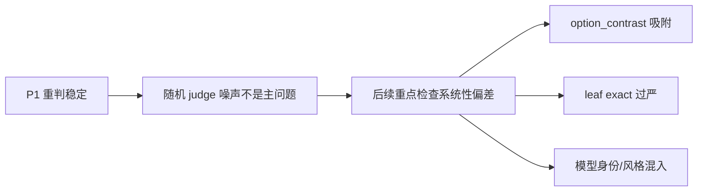
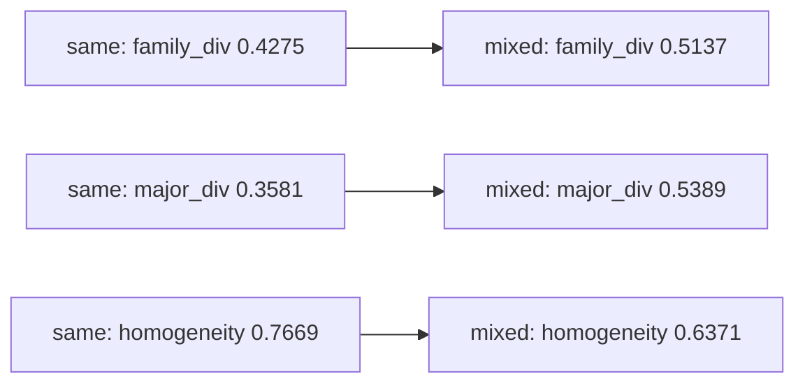

# 证明实验结果总分析（按实验矩阵）

本文按 `prove_experiments/experiment_matrix.md` 的顺序汇总当前证明实验结果。P5 当前未纳入，因为本轮明确先不跑 reward sweep。本文默认采用已完成质量控制后的可用 trace 作为解释口径；当某些模型仍有较多无效 trace 时，只作为风险说明，不再把历史目录作为对照口径展开。

## 0. 指标中文含义

| 指标 | 中文含义 | 解读方向 |
|---|---|---|
| `family_div` / `mean_family_diversity` | 策略树加权多样性。综合 primary/secondary leaf 与同主类相似度后计算 5 个 agent 的策略分散程度。 | 越高表示团队策略越分散。 |
| `homogeneity` / `mean_family_homogeneity_rate` | 策略同质性。衡量 5 个 agent 是否集中在相同或相近策略。 | 越低越好，表示不容易塌缩到同一策略。 |
| `major_div` / `mean_major_family_diversity` | 主类策略多样性。只看 major family 层面的分散程度。 | 越高表示跨大类策略更多。 |
| `target_exact_hit_rate` | 目标 leaf 精确命中率。自动 judge 的 primary/secondary 是否命中 prompt 指定 leaf。 | 严格，但容易受 leaf 粒度和 `option_contrast` 吸附影响。 |
| `target_same_major_hit_rate` | 目标主类命中率。自动 judge 的 primary/secondary 是否落在目标 leaf 所属 major。 | 比 exact 更稳健。 |
| `vote_acc` | 5 个 agent 多数投票答案准确率。 | 用于确认多样性提升是否牺牲答题效果。 |
| `prompt_embedding_cosine_diversity` | prompt 组本身的完整文本 embedding 多样性。对 P2/P3/P4 的 prompt JSON 里的 5 条策略指令做同样的完整文本 embedding 后计算。 | 作为输入提示词本身的客观参考列。 |
| `trace_embedding_cosine_diversity` | 完整 trace embedding 的平均余弦差异，等于 1 - 平均余弦相似度。 | 本报告只使用完整 trace embedding，不使用 summary embedding。 |
| `major_distribution_distance` | 同一道题两个 team 的 major-family 分布距离。 | P4 中作为 major-family 分布距离参考，不作为唯一多样性来源判断。 |

后文表格中的 `trace_embedding_div` 都指完整 trace embedding 的 `1 - mean cosine similarity`。口径上，P2/P4 表格使用 `prove_experiments/cleaned_runs` 下同一 run 的 cleaned prediction 与 trace history；P3 主结果使用 `p3_valid_trace_quality` 标出的同一批 valid questions 重新计算 embedding/token；`prompt_embedding_div` 则来自对应 prompt JSON 的 5 条策略指令本身。不要把 cleaned family 指标与原始 `p4_embedding_metrics.csv` 或 all-question P3 embedding 均值混用。按模型拆开的表里保留 `qwen2.5-7b-instruct` 仅作记录行，主结论默认以 `qwen3.5-plus` 的替换口径理解。

## 1. 总结论

当前结果支持一个谨慎但正向的结论：策略树分类指标确实能测到显式策略 prompt 引起的结构化策略差异，尤其在主类层面更清楚；但它不是纯粹的“真实策略真值”，仍会受到模型身份、输出风格、MMLU 多选题形态和 taxonomy primary 判定规则影响。

最关键的证据链如下：

| 问题 | 当前证据 | 结论 |
|---|---|---|
| judge 是否随机不稳定 | P1 同 trace 重判：major 一致率 0.9700，primary 一致率 0.9533，pair 一致率 0.8617。 | 随机 judge 噪声不是主问题。 |
| 显式不同策略是否提高策略树多样性 | P3 用 qwen3.5-plus 替换 qwen2.5 后的主口径：有效 trace 口径下 mixed - same 的 `family_div` +0.0865、`major_div` +0.1819、`homogeneity` -0.1303，Wilcoxon p 均小于 1e-13；同源补跑也保持同方向。 | 策略 prompt 能系统改变 team-level 策略分布。 |
| 指标是否只是在测模型身份/风格 | P4 的 `same_model_different_prompt_family` 相对 baseline：`family_div` +0.1407、`major_div` +0.2254、`trace_embedding_div` +0.0189、`trace_token_div` +0.0529；`different_model_same_prompt_family` 分别为 +0.1622、+0.2700、+0.0336、+0.1065。 | prompt family 有独立贡献，但模型身份在 taxonomy 与 trace embedding/token 四类多样性指标上都更强，不能把跨模型差异解释成纯 prompt 差异。 |
| leaf exact 是否过严 | P3 mixed exact 低，GPT-5.5 normal judge 在 650 条主口径复核样本中只有 23.38% 继续支持原 `option_contrast` 主判定，49.08% 依然把 `option_contrast` 放入 primary/secondary；78.22% 的旧 776 样本口径不再作为主证据。 | leaf exact 不能作为唯一有效性证据，major/weighted-tree 更可靠。 |
| GPT-5.5 盲评更接近哪类多样性 | P7 新口径从 1700 个 cleaned trace group 中按 `trace_embedding_div` 极值筛出 120 个样本；`high_text` 与 `low_text` 的 GPT-5.5 均值为 2.25 vs 1.00，差值 +1.25，95% CI [1.00, 1.50]；`trace_embedding_div` vs GPT Spearman 为 0.7801，而 `family_div` 只有 0.0534。 | GPT-5.5 盲评主要读到完整 trace 的可见展开差异；P7 的“文本多样性”主口径应使用 `trace_embedding_div`，不能继续把 token diversity 当作主筛选指标。 |
| taxonomy 粒度是否合理 | P6 平均 major-only 0.4060、weighted-tree 0.4735、strict-leaf 0.5875。 | weighted-tree 是折中口径；strict leaf 更敏感但更可能噪声化。 |

## P1. Judge 可靠性

P1 检查同一条 trace 重复交给 judge 时，标签是否稳定。

| trace_count | judgment_count | mean_major_agreement | mean_primary_agreement | mean_pair_agreement | mean_confidence |
|---:|---:|---:|---:|---:|---:|
| 200 | 600 | 0.9700 | 0.9533 | 0.8617 | 0.8433 |

预设通过标准是 major 一致率不低于 0.85，primary 一致率不低于 0.70。当前结果明显通过。因此后续异常更应优先解释为系统性 taxonomy 偏差、prompt 可执行性差异、模型身份差异或 trace 质量问题，而不是随机重判噪声。

## P2. 同策略负对照

P2 的目的不是证明多样性提升，而是确认“同一宽策略的不同措辞”不会被指标误判成强策略多样性。这里把 `family_div`、`major_div`、`homogeneity`、`prompt_embedding_div`、`trace_embedding_div`、`trace_token_div` 和 `vote_acc` 放在同一张表里。P2/P4 表格统一使用 `cleaned_runs` 下同一批 P4 run：`family_div` 来自 cleaned prediction 指标，prompt embedding 来自 prompt JSON，embedding/token 来自同一 run 的 `test_trace_history.jsonl` 完整 trace；我已核对 prediction 与 trace history 的 `question_hash` 集合和 agent family 标签完全一致。这里保留 `qwen2.5-7b-instruct` 作为记录行，主分析的 qwen 口径以 `qwen3.5-plus` 替换后的数据为准。

| model | family_div | major_div | homogeneity | prompt_embedding_div | trace_embedding_div | trace_token_div | target exact | target same-major | vote_acc |
|---|---:|---:|---:|---:|---:|---:|---:|---:|---:|
| deepseek-chat | 0.4786 | 0.4889 | 0.6915 | 0.1506 | 0.0371 | 0.1465 | 0.5680 | 0.5920 | 0.9000 |
| gemini-2.5-flash-lite | 0.4034 | 0.3051 | 0.8256 | 0.1506 | 0.0285 | 0.0767 | 0.7660 | 0.7720 | 0.8000 |
| gpt-4o-mini | 0.4210 | 0.3486 | 0.7618 | 0.1506 | 0.0328 | 0.1102 | 0.7760 | 0.8040 | 0.8400 |
| qwen2.5-7b-instruct | 0.4565 | 0.2851 | 0.7277 | 0.1506 | 0.2087 | 0.4530 | 0.7200 | 0.8180 | 0.7700 |
| qwen3.5-plus | 0.5017 | 0.3709 | 0.7490 | 0.1506 | 0.0416 | 0.1278 | 0.6660 | 0.7180 | 0.9600 |

这个表同时说明两件事：一是 same-elimination 的 target 命中总体仍然高，确实更集中；二是 embedding 多样性并没有把 same-elimination 和 mixed 的结构差异放大到和 family_div 同等的程度，它更多是在反映模型风格和展开方式。qwen2.5-7b-instruct 这条记录行的 embedding 和 token 多样性明显更高，也再次说明它更像风格离群值，而不是最干净的同策略负对照。

## P3. 显式策略干预

P3 当前正式设计使用 4 个 solver model，每个模型跑 100 道 MMLU；same 条件是同一宽策略的选项排除，mixed 条件是 5 个 agent 分别使用来自 5 个不同主类的策略。后续补跑的 qwen3.5-plus 也是同一套设置，这里作为同源补充一起看，但不改变主分析的 same/mixed 结构。必须先确认这 5 个策略确实属于不同主类：

| agent | target leaf | target major | 中文解释 |
|---|---|---|---|
| 0 | `distractor_elimination` | `mmlu_option_semantics` | 逐项排除干扰项，保留最符合题干的选项。 |
| 1 | `rule_or_principle_application` | `mmlu_domain_reasoning` | 先识别领域规则、定理、原则或机制，再应用到题干。 |
| 2 | `decomposition` | `representation_formalization` | 把题干拆成事实、约束和子问题，再合并得到答案。 |
| 3 | `case_analysis` | `logical_proof` | 枚举相关条件、情形或分支并逐一检验。 |
| 4 | `edge_case_analysis` | `optimization_boundary_meta` | 检查边界条件、限定词、例外或极端情形。 |

### P3 主结果

有效 trace 口径下，mixed 条件在总体上比 same 条件更分散。这里把 `family_div`、`major_div`、`homogeneity`、`prompt_embedding_div`、`trace_embedding_div`、`trace_token_div` 和 `vote_acc` 放在同一张表里，所有 embedding 都只用完整 trace，不用 summary embedding。P3 的 prompt embedding 来自 `same_elimination_mmlu.json` 和 `mixed_strategy_mmlu.json` 的 5 条策略指令；trace embedding/token 列按 `p3_valid_trace_quality/p3_valid_trace_question_rows.csv` 中 `valid_all_agents=1` 的同一批题重算，和 valid `family_div` 保持同一题集口径。

| condition | valid questions | family_div | major_div | homogeneity | prompt_embedding_div | trace_embedding_div | trace_token_div | vote_acc |
|---|---:|---:|---:|---:|---:|---:|---:|---:|
| same | 331 / 400 | 0.4275 | 0.3581 | 0.7669 | 0.1506 | 0.0332 | 0.1115 | 0.8775 |
| mixed | 399 / 400 | 0.5137 | 0.5389 | 0.6371 | 0.1899 | 0.0441 | 0.1326 | 0.8797 |
| mixed - same | 399 paired | +0.0865 | +0.1819 | -0.1303 | +0.0393 | +0.0109 | +0.0212 | +0.0025 |

paired 检验结果：

| metric | paired n | mixed - same | 95% CI | Wilcoxon p |
|---|---:|---:|---:|---:|
| `team_family_diversity` | 399 | +0.0865 | [0.0664, 0.1073] | 3.46e-14 |
| `team_family_homogeneity_rate` | 399 | -0.1303 | [-0.1564, -0.1032] | 2.08e-20 |
| `team_major_family_diversity` | 399 | +0.1819 | [0.1443, 0.2186] | 7.56e-18 |

按模型拆开看，把 embedding 列放在同一张表里：

| model | condition | valid questions | family_div | major_div | homogeneity | prompt_embedding_div | trace_embedding_div | trace_token_div | vote_acc |
|---|---|---:|---:|---:|---:|---:|---:|---:|---:|
| deepseek-chat | same | 100/100 | 0.4563 | 0.5023 | 0.6625 | 0.1506 | 0.0366 | 0.1479 | 0.9300 |
| deepseek-chat | mixed | 100/100 | +0.1001 | +0.2561 | -0.1880 | +0.0393 | +0.0126 | +0.0375 | -0.0200 |
| gemini-2.5-flash-lite | same | 100/100 | 0.4124 | 0.3162 | 0.8058 | 0.1506 | 0.0270 | 0.0736 | 0.7900 |
| gemini-2.5-flash-lite | mixed | 99/100 | +0.0422 | +0.0740 | -0.0483 | +0.0393 | +0.0059 | +0.0102 | +0.0181 |
| gpt-4o-mini | same | 100/100 | 0.3395 | 0.2156 | 0.8566 | 0.1506 | 0.0281 | 0.0967 | 0.8600 |
| gpt-4o-mini | mixed | 100/100 | +0.1412 | +0.2087 | -0.1409 | +0.0393 | +0.0130 | +0.0267 | +0.0000 |
| qwen2.5-7b-instruct | same | 31/100 | 0.5538 | 0.5313 | 0.6095 | 0.1506 | 0.0627 | 0.1880 | 0.6774 |
| qwen2.5-7b-instruct | mixed | 81/100 | +0.0686 | +0.2049 | -0.1494 | +0.0393 | +0.0020 | +0.0274 | +0.0880 |
| qwen3.5-plus | same | 100/100 | 0.5016 | 0.3982 | 0.7426 | 0.1506 | 0.0409 | 0.1278 | 0.9300 |
| qwen3.5-plus | mixed | 100/100 | +0.0610 | +0.1830 | -0.1406 | +0.0393 | +0.0123 | +0.0100 | +0.0100 |

qwen2.5-7b-instruct 在 same 条件下有效题数只有 31/100，因此它的 P3 same 估计方差很大；而且按当前统一的 valid-trace 口径重算后，它的 `trace_embedding_div` 也并不是负值，而是和 `family_div` 同向上升。先前“family_div 为正但 trace_embedding_div 为负”的印象，主要来自把不同层级、不同汇总口径混看，尤其是把 all-question 与 valid-question 口径错开，再叠加 qwen2.5 same 条件样本过少带来的波动。对照同设置补跑的 qwen3.5-plus，same 与 mixed 两边都保持 `family_div` 和 `trace_embedding_div` 同向变化，更像干净的同源对照，也说明那一处负号更像口径/样本稳定性问题，而不是普遍现象。

### P3 目标策略命中

P3 的关键不是每个 agent 都稳定命中指定 leaf，而是 team-level 策略分布是否随 prompt 改变。目标命中拆解如下：

| condition | agent | target leaf | target major | exact | same-major(any) | top primary | top primary share |
|---|---:|---|---|---:|---:|---|---:|
| mixed | 0 | `distractor_elimination` | `mmlu_option_semantics` | 0.3300 | 0.7600 | `option_contrast` | 0.4600 |
| mixed | 1 | `rule_or_principle_application` | `mmlu_domain_reasoning` | 0.2200 | 0.4700 | `concept_definition_match` | 0.2400 |
| mixed | 2 | `decomposition` | `representation_formalization` | 0.1400 | 0.1500 | `option_contrast` | 0.3400 |
| mixed | 3 | `case_analysis` | `logical_proof` | 0.2800 | 0.3000 | `option_contrast` | 0.3500 |
| mixed | 4 | `edge_case_analysis` | `optimization_boundary_meta` | 0.0100 | 0.0100 | `option_contrast` | 0.3200 |

`distractor_elimination` 的 same-major 命中最高，`decomposition` 和 `case_analysis` 的 exact 命中也并不低，但 `edge_case_analysis` 最弱。`option_contrast` 仍是很多 mixed trace 的 top primary，说明 MMLU 多选题的可见推理形态容易被 judge 判成选项比较。这是 P3 暴露出的主要风险：策略树分数提升是真实的，但 leaf exact compliance 不能直接解释为“每个 agent 都按指定 leaf 严格执行”。

### P3 GPT-5.5 复核

GPT-5.5 复核分成两层。第一层是 normal taxonomy judge：给 GPT-5.5 与正式 judge 尽量接近的信息，让它重新给 trace 打 taxonomy 标签，这是判断自动 judge/taxonomy 是否偏移的主证据。第二层是 prompt-following：只给原始策略指令、题目片段和 trace，不给 taxonomy 标签，让 GPT-5.5 判断模型是否大体遵循了 prompt，这是辅助诊断，用来区分“trace 没听 prompt”和“taxonomy 映射/`option_contrast` 吸附”。

先看总体。原自动 judge 的复核样本全部来自 `option_contrast` 主判定，因此 `primary option` 和 `pair option` 都是 1.0000；GPT-5.5 重判后，`primary option` 降到 0.2338，`pair option` 降到 0.4908，同时 `questioned` 达到 0.7662。这说明原 judge 对 MMLU 多选题 trace 存在明显 `option_contrast` 吸附，很多 trace 并不是只能解释为选项比较。另一方面，GPT-5.5 的整体 `target exact` 只有 0.2138，`target same-major` 只有 0.2708，说明吸附被削弱以后，目标 leaf/major 的精确命中仍然不高，不能把 prompt compliance 简化成“每个 agent 都稳定命中指定 taxonomy leaf”。

| judge | primary option | pair option | target exact | target same-major | questioned | confidence |
|---|---:|---:|---:|---:|---:|---:|
| original auto judge | 1.0000 | 1.0000 | 0.0979 | 0.2307 | - | - |
| GPT-5.5 rejudge | 0.2338 | 0.4908 | 0.2138 | 0.2708 | 0.7662 | 0.9217 |

逐策略看时，原自动 judge 与 GPT-5.5 rejudge 的目标策略命中、以及 GPT-5.5 prompt-following 诊断放在同一张表里。`exact` 是目标 leaf 精确命中，`same-major` 是目标主类命中，`GPT followed` 是不看 taxonomy 标签时对“是否按策略指令组织推理”的判断。

| agent | target | normal n | judge exact | GPT exact | judge same-major | GPT same-major | judge primary option | GPT primary option | prompt n | GPT followed | mean score | judge taxonomy likely | model prompt likely | ambiguous |
|---:|---|---:|---:|---:|---:|---:|---:|---:|---:|---:|---:|---:|---:|---:|
| 0 | `distractor_elimination` | 130 | 0.2185 | 0.4000 | 0.4908 | 0.8769 | 0.4908 | 0.1846 | 130 | 0.7692 | 4.0923 | 0.7692 | 0.1615 | 0.0692 |
| 1 | `rule_or_principle_application` | 130 | 0.2476 | 0.2462 | 0.4286 | 0.4077 | 0.4286 | 0.2477 | 130 | 0.6615 | 3.7231 | 0.6462 | 0.2815 | 0.0723 |
| 2 | `decomposition` | 130 | 0.2821 | 0.0231 | 0.5641 | 0.0308 | 0.5641 | 0.3200 | 130 | 0.7031 | 3.8308 | 0.7031 | 0.2277 | 0.0692 |
| 3 | `case_analysis` | 130 | 0.2652 | 0.0000 | 0.5379 | 0.0000 | 0.5379 | 0.2523 | 130 | 0.7538 | 3.8923 | 0.7538 | 0.1777 | 0.0685 |
| 4 | `edge_case_analysis` | 130 | 0.1724 | 0.0000 | 0.4345 | 0.0154 | 0.4345 | 0.1462 | 130 | 0.5846 | 3.5154 | 0.5846 | 0.3115 | 0.1038 |

更完整的策略 prompt 原文与样本对应关系已另存于 `prove_experiments/prompt_sets.md` 和各子实验的 key/packet 文件中，因此这里不再重复展开。

P3 GPT-5.5 复核结论：在这批与目标策略命中对齐的复核样本中，原自动 judge 对 `option_contrast` 有明显吸附，GPT-5.5 重判后 5 个策略的 `primary option` 都下降，整体从 1.0000 降到 0.2338；但这不等于 trace 完全不遵循 prompt。`distractor_elimination` 在 GPT-5.5 下最可判定，`GPT same-major` 达到 0.8769；`rule_or_principle_application` 的 GPT exact/same-major 与原 judge 接近，说明有一定遵循但不稳定；`decomposition`、`case_analysis`、`edge_case_analysis` 的 GPT same-major 很低，同时 `decomposition` 和 `case_analysis` 的 `GPT followed` 仍有 0.7031 和 0.7538，说明问题主要是“prompt 行为”与预设 taxonomy major/leaf 的映射不一致，而不是简单的“不听 prompt”。因此 P3 复核支持的具体结论是：leaf exact 和 same-major 只能作为 taxonomy 命中诊断，不能单独作为 prompt 成功阈值；解释 P3 时应同时报告 team-level `family_div`、`major_div`、`homogeneity` 和 GPT prompt-following。

P3 综合结论：策略树指标确实测到了显式策略 prompt 导致的结构化变化；但 exact leaf hit 过严，并且部分策略 prompt 可执行性不足。对齐到同一批有效题后，`trace_embedding_div` 和 `trace_token_div` 也随 mixed 策略上升，但幅度小于 `family_div` / `major_div`，说明 embedding/token 能看到部分完整 trace 展开差异，而 taxonomy family 指标对显式策略干预更敏感。qwen3.5-plus 的同源补跑把这一点钉得更稳，因为它在 same 和 mixed 两边都保持了与 `family_div` 同向的 `trace_embedding` 变化。

## P4. 跨 LLM 策略迁移

P4 这里按“一个 exact baseline + 五个比较组”重新核对，主分析统一排除 `qwen2.5-7b-instruct`，保留 `qwen3.5-plus` 作为替代。所有数值都来自同一批 cleaned runs、同一批题、同一批 trace。这里研究的是多样性的来源，因此 `family_div`、`major_div`、`trace_embedding_div` 和 `trace_token_div` 是同级主指标，`major_dist` 只作为 major-family 分布距离的补充参考。

| exact baseline | n | family_div | major_div | homogeneity | prompt_embedding_div | trace_embedding_div | trace_token_div | vote_acc | major_dist |
|---|---:|---:|---:|---:|---:|---:|---:|---:|---:|
| same_model_same_prompt | 2 | 0.3771 | 0.2582 | 0.8423 | 0.0000 | 0.0234 | 0.0802 | 0.9050 | 0.2582 |

| comparison group | n | family_div | major_div | homogeneity | prompt_embedding_div | trace_embedding_div | trace_token_div | vote_acc | major_dist |
|---|---:|---:|---:|---:|---:|---:|---:|---:|---:|
| different_model_same_prompt | 1 | 0.4440 | 0.3288 | 0.7735 | 0.0000 | 0.0537 | 0.1658 | 0.9050 | 0.1816 |
| same_model_same_prompt_family | 12 | 0.4801 | 0.4420 | 0.7099 | 0.1658 | 0.0404 | 0.1272 | 0.8808 | 0.4419 |
| same_model_different_prompt_family | 12 | 0.5179 | 0.4835 | 0.6828 | 0.1853 | 0.0423 | 0.1331 | 0.8808 | 0.2031 |
| different_model_same_prompt_family | 18 | 0.5394 | 0.5282 | 0.6385 | 0.1509 | 0.0571 | 0.1867 | 0.8808 | 0.3032 |
| different_model_different_prompt_family | 36 | 0.5448 | 0.5310 | 0.6312 | 0.1853 | 0.0577 | 0.1882 | 0.8808 | 0.3105 |

相对 exact baseline 的 signed delta：

| contrast | Δ family_div | Δ major_div | Δ homogeneity | Δ prompt_embedding_div | Δ trace_embedding_div | Δ trace_token_div | Δ vote_acc | Δ major_dist |
|---|---:|---:|---:|---:|---:|---:|---:|---:|
| different_model_same_prompt | +0.0669 | +0.0706 | -0.0688 | 0.0000 | +0.0302 | +0.0856 | 0.0000 | -0.0766 |
| same_model_same_prompt_family | +0.1030 | +0.1839 | -0.1324 | +0.1658 | +0.0169 | +0.0470 | -0.0242 | +0.1837 |
| same_model_different_prompt_family | +0.1407 | +0.2254 | -0.1594 | +0.1853 | +0.0189 | +0.0529 | -0.0242 | -0.0550 |
| different_model_same_prompt_family | +0.1622 | +0.2700 | -0.2037 | +0.1509 | +0.0336 | +0.1065 | -0.0242 | +0.0451 |
| different_model_different_prompt_family | +0.1677 | +0.2729 | -0.2111 | +0.1853 | +0.0343 | +0.1080 | -0.0242 | +0.0524 |

P4 结论：在排除 `qwen2.5-7b-instruct`、使用 `qwen3.5-plus` 替代后的同源数据上，prompt family 能独立提高策略多样性，但模型身份在本实验里是更强的多样性来源。相对 exact baseline，`same_model_different_prompt_family` 的 `family_div`、`major_div`、`trace_embedding_div`、`trace_token_div` 分别增加 +0.1407、+0.2254、+0.0189、+0.0529；`different_model_same_prompt_family` 在同四个指标上分别增加 +0.1622、+0.2700、+0.0336、+0.1065，四项都更高。进一步看，完全相同 prompt 下只换模型的 `different_model_same_prompt` 已经带来 `trace_embedding_div` +0.0302 和 `trace_token_div` +0.0856，说明 trace 展开差异对模型身份非常敏感；而 prompt family 变化主要更稳定地推动 taxonomy 侧的 `family_div`/`major_div`。两者叠加的 `different_model_different_prompt_family` 在四个多样性指标上整体最高，因此 P4 支持的结论不是“只看 major_dist”，而是：模型身份和 prompt family 都会贡献多样性，其中模型身份对 trace embedding/token 和 taxonomy 指标的综合贡献更大，后续报告必须把 exact baseline、跨模型同 prompt、跨 prompt family 三类因素拆开。

## P5. Reward 权重 Sweep

P5 尚未运行，因此不能证明“策略树 reward 一定可优化”或“不会过强”。当前能说的只有：

| 待验证问题 | 需要 P5 给出的证据 |
|---|---|
| 指标是否约束太强 | `weak/default/strong/strict/softened_tree` sweep 中是否存在可提升区间。 |
| 提升是否靠坏 trace | diversity 提升是否伴随 invalid trace 增加。 |
| reward 是否可优化 | update applied rate、candidate family shift、validation/test family diversity 是否同步改善。 |
| strict leaf 是否过硬 | strict_tree 是否比 softened_tree 更难优化或更不稳定。 |

在 P5 未完成前，关于“该指标是否约束太强导致很难提升”的结论只能保留为开放问题。P3 说明 prompt 干预能提升指标，但不等同于训练 reward 一定容易优化。

## P6. Taxonomy 粒度敏感性

P6 在同一批 trace 上离线重算三种粒度：

| 粒度 | 平均 diversity | 含义 |
|---|---:|---|
| major-only | 0.4060 | 只看主类，最稳但可能漏掉同主类内部差异。 |
| weighted-tree | 0.4735 | 当前主指标，兼顾 leaf 与 same-major 相似度。 |
| strict leaf-only | 0.5875 | 最敏感，但也最容易把近义 leaf 或 judge 边界误差放大。 |

P6 说明 weighted-tree 是合理折中：它比 major-only 更能捕捉细分策略，比 strict leaf-only 更不容易过度依赖 leaf exact。结合 P3 GPT-5.5 复核，当前最稳的报告口径应是 weighted-tree + major-level，而不是 strict leaf exact。

## P7. GPT-5.5 盲评

P7 让 GPT-5.5 不看 model、prompt、label 和自动指标，只看匿名 traces，判断真实方法多样性。这里重做了 P7 的抽样口径：文本多样性不再用 token diversity 作为主筛选指标，而是用完整 trace embedding 的 `trace_embedding_div`；并从 `cleaned_runs` 的 1700 个可用 question-run trace group 中按极值筛选最典型样本。新增 `high_text` / `low_text` 两个纯文本 bucket，分别对应 `trace_embedding_div` 最高和最低的 traces。

| bucket | n | family_div | major_div | trace_embedding_div | trace_token_div | GPT-5.5 score |
|---|---:|---:|---:|---:|---:|---:|
| high_text | 20 | 0.5062 | 0.3125 | 0.3334 | 0.6279 | 2.2500 |
| low_text | 20 | 0.2646 | 0.1317 | 0.0034 | 0.0198 | 1.0000 |
| high_strategy | 20 | 0.9282 | 0.9590 | 0.0581 | 0.1930 | 1.3000 |
| low_strategy | 20 | 0.0000 | 0.0000 | 0.0090 | 0.0561 | 1.0000 |
| high_text_low_strategy | 20 | 0.2842 | 0.0292 | 0.3019 | 0.5945 | 2.2500 |
| low_text_high_strategy | 20 | 0.7054 | 0.8382 | 0.0134 | 0.0576 | 1.1500 |

| metric | Spearman rho vs GPT-5.5 score | n |
|---|---:|---:|
| family_div | 0.0534 | 120 |
| major_div | -0.1677 | 120 |
| trace_embedding_div | 0.7801 | 120 |
| trace_token_div | 0.8015 | 120 |

P7 结论：在极值抽样后的 120 个盲评样本中，GPT-5.5 对 `trace_embedding_div` 高低非常敏感，而对 taxonomy family/major 多样性不敏感。纯文本高低 bucket 的 GPT-5.5 均值分别为 2.25 和 1.00，差值 +1.25，95% CI [1.00, 1.50]；交叉对照中，`high_text_low_strategy` 为 2.25，`low_text_high_strategy` 为 1.15，差值 +1.10，95% CI [0.85, 1.35]。纯策略高低 bucket 也有小幅差异，`high_strategy` 1.30 对 `low_strategy` 1.00，差值 +0.30，95% CI [0.10, 0.50]，但整体相关性仍很弱：`family_div` Spearman 只有 0.0534，`major_div` 甚至为 -0.1677。相反，`trace_embedding_div` 和 `trace_token_div` 的 Spearman 分别为 0.7801 和 0.8015。新版 P7 因此支持一个更清楚的解释：GPT-5.5 盲评主要读到完整 trace 的可见展开差异；如果报告里把“文本多样性”作为 P7 的主对照，应使用 `trace_embedding_div`，而不是之前可能混用的 token diversity。

为了比较 `trace_embedding_div` 和 `trace_token_div` 谁更贴近 GPT-5.5，我又在同一批 120 条已评样本上重排 top/bottom 20。结果是 `trace_token_div` 略强：Spearman 0.8015、AUC(score>=2) 0.9732、top20 vs bottom20 的 GPT 均值 2.40 vs 1.00，差值 +1.40，95% CI [1.20, 1.60]；`trace_embedding_div` 对应为 Spearman 0.7801、AUC 0.9601、top20 vs bottom20 的 GPT 均值 2.25 vs 1.00，差值 +1.25，95% CI [1.00, 1.50]。两者 high/low top20 各只重叠 14/20，说明 token 指标不是完全复刻 embedding 极值选择。这个补充只是在当前 embedding-extreme P7 样本内的诊断，不等于新的独立抽样实验；但它解释了为什么 GPT-5.5 看起来更贴近 token diversity：GPT 的盲评会把 answer-only、长短差异、重复退化、逐项展开和公式/选项显式程度都纳入“可见方法差异”，这些结构差异正是 token cosine 比句向量 embedding 更容易保留的部分。

## P8. 任务依赖性

P8 检查策略多样性干预是否对不同 MMLU subject 都同样有效。

| dataset | subject_count | paired_subject_count | mean_subject_intervention_effect | positive_subject_rate |
|---|---:|---:|---:|---:|
| mmlu | 212 | 212 | 0.0706 | 0.6132 |

P8 结论：按 MMLU subject 分层并在同一 subject 内比较 mixed 相对 same 后，prompt 干预平均能提升策略多样性，mean_subject_intervention_effect 为 +0.0706；但 positive_subject_rate 只有 0.6132，说明接近四成 subject 没有稳定正向提升。结合很多 subject 的 paired question count 较小，单个 subject 的方向不宜过度解读；更可靠的结论是，策略树指标的可提升性有明显任务依赖，后续做 reward 优化或主结果汇报时应按 subject/题型分层，而不能只给总体均值。

## 结论与风险

当前最稳妥的结论是：

1. 策略树分类指标测到了真实的 prompt-induced 策略分布变化，P3 用 qwen3.5-plus 替换 qwen2.5 后的主口径依然给出强正证据，同源补跑没有改变这个方向。
2. 该指标不应被解释为纯粹的人类感知方法多样性；新版 P7 表明 GPT-5.5 盲评更贴近完整 trace embedding/token 展开差异，而不是 taxonomy family/major 分布本身。
3. leaf exact hit 过严，且 `option_contrast` 存在吸附；应优先报告 weighted-tree 和 major-level 指标。
4. 模型身份是比 prompt family 更主要的综合多样性来源；P4 中 `different_model_same_prompt_family` 相比 `same_model_different_prompt_family` 在 `family_div`、`major_div`、`trace_embedding_div`、`trace_token_div` 四项上都更高。
5. P5 尚未运行，因此“reward 是否过强、是否难以提升”仍是开放问题。

后续最有价值的补充是 P5 sweep，以及对 `edge_case_analysis`、`rule_or_principle_application` 这两个弱遵循策略重写 prompt 后复测。
