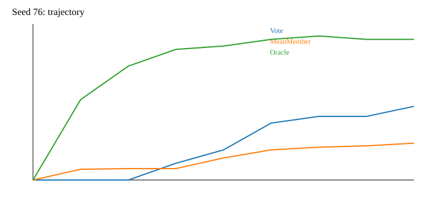
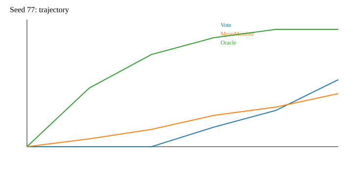
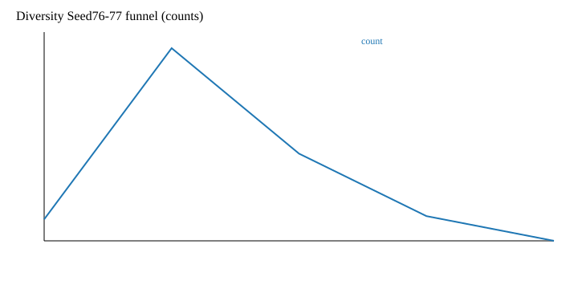
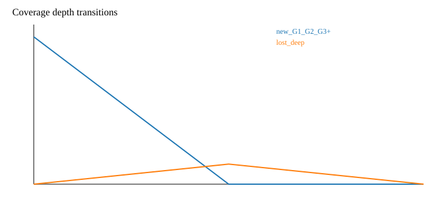

# Diversity Write-back Cost & Coverage-to-Vote Failure Audit

Zero-API, zero-Test50, read-only audit of formal Seed76–77 P1 trajectories. Seed75 raw usage remains excluded because it is not fully recoverable.

## Table A — Cost funnel

| Opportunities | Generated | Valid | Feasible | Commits | Solver calls | Optimizer calls | Tokens | Tokens / commit |
|---:|---:|---:|---:|---:|---:|---:|---:|---:|
| 33 | 192 | 94 | 36 | 13 | 15,209 | 429 | 10,666,948 | 820,534 |

## Table B — Where compute goes

The exact role ledger assigns 93.55% of tokens to Solver-side empirical evaluation and 6.45% to optimizer calls. The Solver ledger has no update/candidate/stage ID, so winner/discarded and member/team/shadow sub-stages are deliberately `NOT_RECOVERABLE` rather than estimated.

## Table C — What committed updates buy

| Class | Count |
|---|---:|
| C1_BROAD_GAIN | 12 |
| C2_USEFUL_SPECIALIZATION | 1 |

Commit-level outcomes are in `diversity_commit_utility.csv`; they are optimization-time Train100 transitions and are not combined with common-contract final replay metrics.

## Frozen final-state common-contract replay (separate provenance)

| Seed | State | Vote | MeanMember | Oracle |
|---:|---|---:|---:|---:|
| 76 | P0 | .60 | .600 | .60 |
| 76 | Diversity P1 final | .66 | .588 | .92 |
| 77 | P0 | .62 | .620 | .62 |
| 77 | Diversity P1 final | .58 | .580 | .86 |

The row-level aggregates are in `common_contract_final_state_results.csv`; this is separate provenance from Train100 transition utility.

## Table D — Architecture and cost

| Method | Optimization-only tokens | Solver calls | Main topology |
|---|---:|---:|---|
| MARS | 2,951,027 (3 seeds) | 2,000 | meta pipeline then task evaluation |
| GEPA | 3,754,403 (3 seeds) | 1,996 | candidate then broad task evaluation |
| Diversity | 10,666,948 (Seeds76–77) | 15,209 | member/team empirical rollout |

## Answers

**Q1 — Cost.** The exact 820,535 tokens per commit is rollout-heavy: 93.55% of Seed76–77 tokens are Solver-side. Candidate multiplicity is 5.82 generated candidates/opportunity, with 79.2 Solver calls/generated candidate and 1169.9 Solver calls/commit. The ledger cannot identify the split among member, team, safety, and shadow passes, so it does not support a numerical winner-versus-discarded decomposition.

**Q2 — Coverage versus plurality.** Responsibility and assigned residual evidence enter generation, while Common-Safe gives hard target/Vote non-regression. Mean-member total gain appears in Stage-A ranking, but Oracle, coalition depth, transfer, and broad preservation lack an equivalent direct hard/ranking key. This is code-grounded pressure asymmetry, not a causal proof of the observed final-state pattern.

**Q3/Q4 — structural comparison.** GEPA has broad candidate-to-task evaluation and 88.15% Solver token share; MARS is meta-heavier (30.04% optimizer-token share). Diversity is more rollout-heavy (93.55% Solver token share) because five-member fixed-peer safety must be empirically checked. Historical contracts differ, so this is not a formal efficacy ranking.

**Primary diagnosis:** H_COST supported: empirical Solver validation dominates observed cost. **Secondary diagnosis:** H_OBJECTIVE partially supported: selection pressure has no direct coalition-depth/transfer key. H_SELECTION is not evaluable without frozen alternative validation.

**Smallest justified next experiment:** a frozen fixed-parent comparison that holds candidate generation constant and compares the historical Common-Safe winner with a coalition-depth-aware *analysis-only* ranking, with no trajectory write-back.
