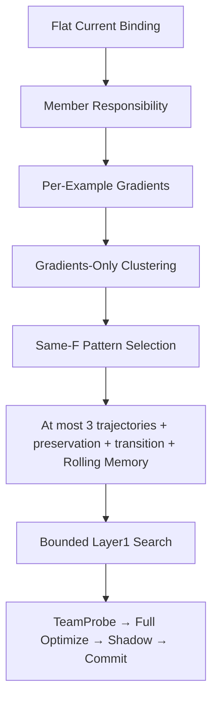

# Current Runtime Consolidation V1

Semantic-preserving engineering refactor. `SCIENTIFIC_DIFF = EMPTY` across all
31 frozen golden fields; provider-visible requests and optimizer inputs are
byte identical. No new scientific efficacy result was produced.

| Receipt | Value |
|---|---|
| BASE_HEAD | `08c632eb581b25699da0c4aa480b986e0de61e02` |
| FINAL_RUNTIME_SOURCE | `f99e4d46759232eecd566fa840852a18dfe1d54d` |
| FULL_CURRENT_SUITE_SOURCE | `f99e4d46759232eecd566fa840852a18dfe1d54d` |
| Full current public suite | 1215 passed, 2 skipped; zero failures |
| Current execution CLI | `scripts/run_experiment.py` |
| Current builder | `build_current_team_prompt_search` |
| Current policy bundle | `CurrentPolicyBundle`; fixed Gradient ON and Rolling Memory ON |
| Current → legacy dependencies | 0; static closure and fresh-process imports |
| Scientific method identity | `806f7851f705069d475453615c0bc5344c5cc83a36acfba3efddefa8bd33d0be` |
| Real provider calls | 0 |
| Canary / Pilot / Validation / Test model execution | None |
| Push | NO |

| Current dependency closure metric | Before | After |
|---|---:|---:|
| Modules | 177 | 137 |
| LOC | 48874 | 28070 |
| Class definitions | 518 | 375 |
| Treatment-selection branches in builder | 40 | 0 |
| Reachable historical treatment definitions | 13 | 0 |

The comparable AST audit starts at the CLI, effective MATH binding and builder,
includes package initializers and function-scoped static imports, and counts
all reachable modules. Branch counts exclude pure raising guards and phase-stop
checks. BASE had no explicit legacy namespace; its 13 old treatment definitions
and their import edges are the useful baseline. These are engineering metrics,
not a LOC target or an efficacy claim.

No complete module was deleted. 26 implementation modules
were isolated under `search/legacy/`, `benchmarks/legacy/` and `governance/legacy/`.
Explicit replay uses `scripts/replay_experiment.py`; forwarding imports preserve
public compatibility. Current Layer1 no longer inherits Raw-Pattern treatment
classes, and the flat current binding never instantiates a parent binding.
Historical parents supply JSON/hash provenance only. Current data and installed
dependency integrity checks remain active without loading a GEPA engine.

Shared responsibility math, request broker, evidence records, generic bounded
Layer1 utilities, text-copy checks, private action state and memory transactions
remain shared primitives. Current context assembly serializes once. Missing
Gradient or Memory dependencies and historical policies are rejected before
provider dispatch. No fallback is available.

Equivalence evidence covers 343 shared-F cases, 64 golden Memory transactions,
and 63 additional Memory snapshots compared with original BASE Python blobs.
The latter cover private failure cap 5, cross-member promotion, private success,
rolling eviction, retrieval ordering, visible bytes and transaction counters.
The 36-metric, six-generation, four-export ceilings and the 12+1 Pattern call
ceiling are unchanged. Successful-provider and transport ceilings remain
1,651 and 34,671. These are offline-profile ceilings, not API authorization.

The classified public historical replay was also attempted: 1,394 passed,
six failed and four skipped. All six failures reproduce on BASE: four depend
on unavailable historical private fixtures, one expects an obsolete model
default and one expects obsolete error wording. Legacy implementation files
did not change after that replay source. Its guard blocked 12 network attempts;
no connection or real provider call occurred. Historical replay is **NOT PASS**.
The separately classified 64 private-artifact cases were not run. The full
current suite has zero network attempts and is the acceptance suite for this
refactor. Its two skips are the user-deferred HoVer and PUPA real-data manifests.

All 4,046 inventoried immutable historical report, manifest and receipt files
remain byte identical. `reports/INDEX.md` and `reports/index.json` are generated
views and are the only preexisting report-file exceptions. The cumulative real
token ledger is unchanged. Unknown unrelated untracked artifacts were preserved.

Compileall, governance/manifest preflight, 24 active invariant checks,
deterministic golden and Memory replay, sanitization and `git diff --check`
pass. Failure-registry schema repairs preserve the original evidence wording
and scientific classifications; they change no runtime policy. The milestone
manifest remains DRAFT with no API authorization or runnable freeze. Final
publication commits contain engineering evidence and completion metadata only;
runtime code and current tests remain the tested source above.

Required receipts are stored alongside this README: reachability/dependency
maps, pre/post golden contracts, scientific/provider/Memory/F/budget equivalence,
legacy isolation, dead-code and complexity audits, zero-API verification,
historical replay limitations and the SHA256 manifest. Synthetic payloads,
requests, answers, run directories and JUnit files remain ignored; published
receipts contain only identities, hashes, counts, categories and metadata.
